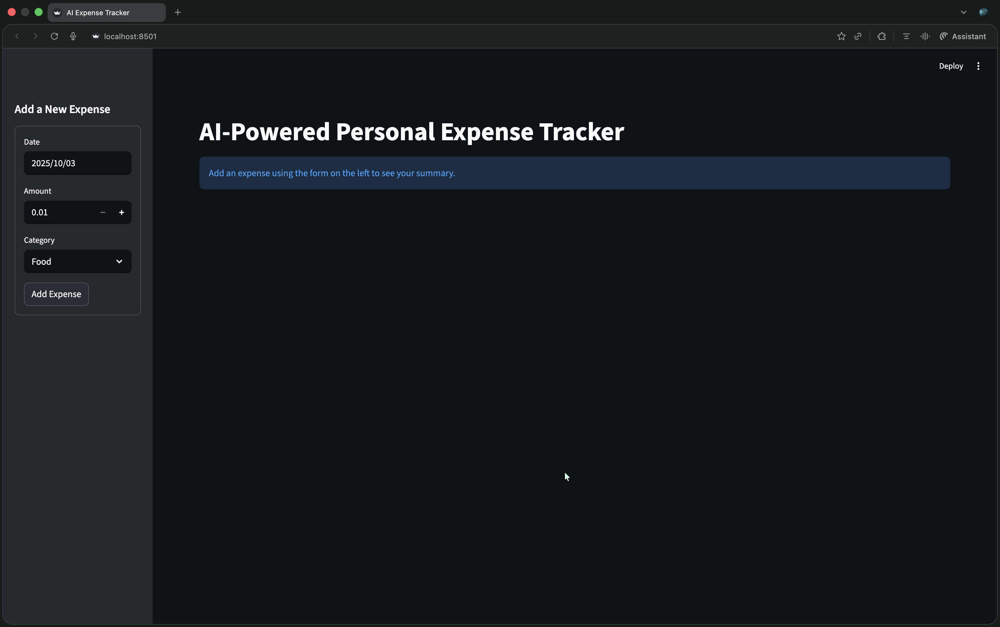
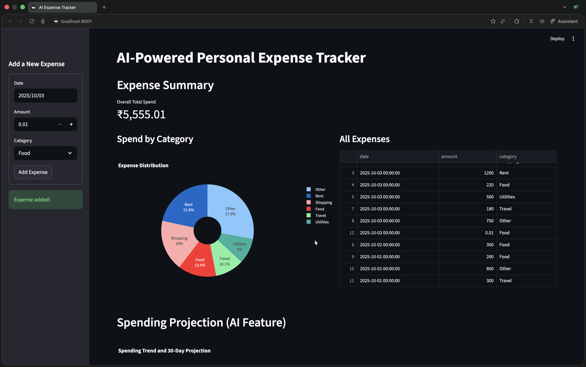
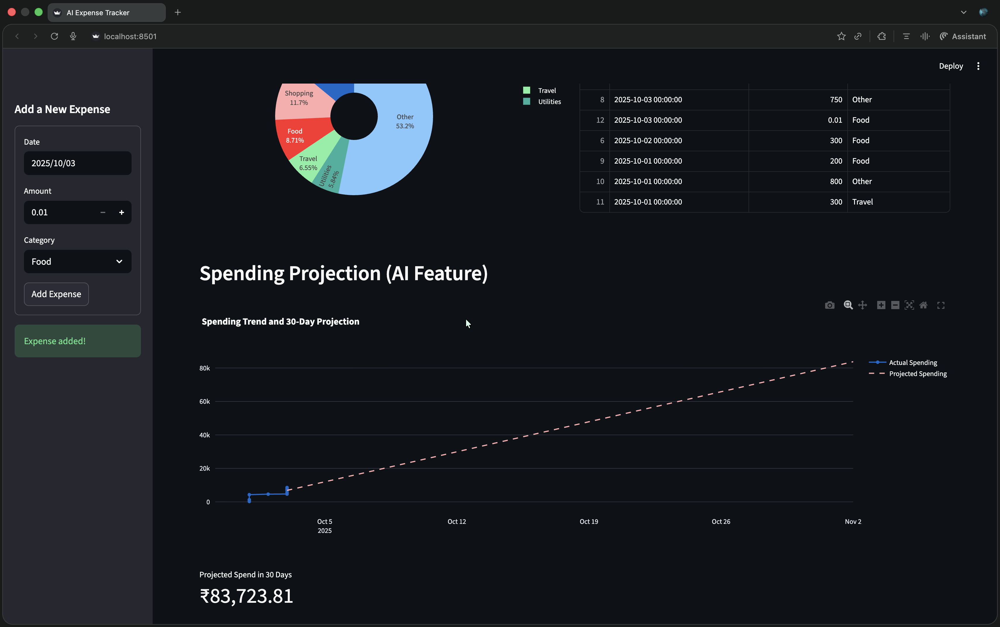

# AI-Powered Personal Expense Tracker

This project is a simple but powerful personal expense tracking application built as part of an intern assignment. The goal was to demonstrate effort, resourcefulness, and creativity by building an AI-powered app from scratch. The application is built with Python and uses the Streamlit framework for its user interface.

### Application Preview

Here's a look at the application's key features, from its initial state to the final projection.

**1. Clean Starting Interface**


**2. Main Dashboard**


**3. AI Spending Projection**


> **Pro Tip:** To make your repository even more dynamic, you can record a short video of you using the app and convert it into an animated GIF. You can use a free online tool like Giphy or ezgif.com to do this. An animation is a great way to quickly show all the features in action!

---

## ✨ Features

* **Add Expenses**: Easily add new expenses with a specific date, amount, and category using the simple form in the sidebar.
* **Expense Summary**: Get an at-a-glance view of your total spending in Indian Rupees (₹).
* **Categorical Breakdown**: Visualize your spending distribution across different categories with an interactive pie chart.
* **AI-Powered Projection**: See an **animated** 30-day spending projection based on your current habits, powered by a simple linear regression model.
* **Full Expense History**: View all your recorded expenses in a clean, sortable table.

---

## 🛠️ Tech Stack
* **Language**: Python
* **UI Framework**: Streamlit
* **Data Manipulation**: Pandas
* **Data Visualization**: Plotly
* **Machine Learning**: Scikit-learn

---

## 🚀 Setup and Installation

To run this project locally, please follow these steps:

**1. Prerequisites**
   * Ensure you have Python 3.8 or newer installed on your system.

**2. Clone the Repository**
   ```bash
   git clone [https://github.com/Pranay1301/AI-Powered-Expense-Tracker.git](https://github.com/Pranay1301/AI-Powered-Expense-Tracker.git)
   cd AI-Powered-Expense-Tracker
   ```

**3. Create and Activate a Virtual Environment**
   ```bash
   # Create the virtual environment
   python3 -m venv .venv

   # Activate the virtual environment (on macOS/Linux)
   source .venv/bin/activate
   ```

**4. Install Dependencies**
   * Install all the required libraries from the `requirements.txt` file.
   ```bash
   pip install -r requirements.txt
   ```

**5. Run the Streamlit App**
   * Once the dependencies are installed, you can run the application.
   ```bash
   streamlit run app.py
   ```
   The application should now be open in your web browser!

---

## 📝 Development Journey

This section documents the steps, challenges, and learning process involved in building this application, as required by the assignment.

### Phase 1: The Core Idea
The initial goal was to build a simple command-line **Personal Expense Tracker**. The first version was a basic Python script that allowed a user to add expenses (amount, category) and view a text-based summary.

### Phase 2: Building a User Interface
To fulfill the assignment's stretch goal, I decided to add a simple UI. I chose **Streamlit** because it allows for the rapid development of web-based UIs directly in Python. This phase involved migrating the core logic from the CLI script to a Streamlit app structure.

### Phase 3: Adding Advanced Features & AI
To go beyond the minimum requirements, I added several key features:
* **Date Tracking**: The model was enhanced to include a date for each expense.
* **Data Visualization**: I used the **Plotly** library to create an interactive pie chart.
* **AI Projection**: I implemented an "AI-powered" projection feature using a **Linear Regression** model from **Scikit-learn** to forecast future spending.

### Phase 4: Troubleshooting and Debugging
During development, the application would not run after adding new libraries.

* **Problem**: The console showed a `ModuleNotFoundError` for both `plotly` and `sklearn`.
* **Solution**: The issue was resolved by running `pip install plotly scikit-learn` in the terminal with the correct virtual environment activated. This was a key learning moment about the importance of managing dependencies.

### Phase 5: Final Touches & Animations
As final customizations, the currency was changed to Indian Rupees (₹), and a dynamic animation was added to the spending projection chart to make the visualization more engaging.

---
Created by **Pranay**
